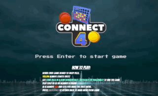

# Connect 4 Game

### Description

This game is played on a vertical board wich has seven hollow columns and six rows. Each column has a hole in the upper part of the board, where pieces are introduced. There is a window for every square, so that pieces can be seen from both sides.

In short, it´s a vertical board with 42 windows distributed in 6 rows and 7 columns.

Both players have a set of 21 thin pieces (like coins); each of them uses a different colour. The board is empty at the start of the game.

The player with yellow coins will start first. 

### Objective

The aim for both players is to make a straight line of four own pieces; the line can be vertical, horizontal or diagonal.

### How the game goes on

Before starting, players decide randomly which of them will be the beginner; moves are made alternatively, one by turn.

Moves entails in placing new pieces on the board; pieces slide downwards from upper holes, falling down to the last row or piling up on the last piece introduced in the same column. So, in every turn the introduced piece may be placed at most on seven different squares.

The winner is the first player who gets a straight line made with four own pieces and no gaps between them.

## App Instructions

Fork it and open landingpage.html to load up the main landing page. 

Press 'Enter' key for Windows or 'Return" key for Mac OS to start game. 

Rules are as mentioned above. 

## Additional Features

Play against a friend on multiplayer mode

Or alternatively play against an AI whose algorithm is based off the minimax algorithm. 

Adjust AI difficulty accordingly using the buttons on the side of the game board. 

## Tech stacks used

HTML, CSS, Javascript. 

Misc: font-awesome. 

## References

<https://en.wikipedia.org/wiki/Minimax#:~:text=chances%20of%20winning).-,Minimax%20algorithm%20with%20alternate%20moves,or%20state%20of%20the%20game>

<https://fontawesome.com/v4.7.0>
